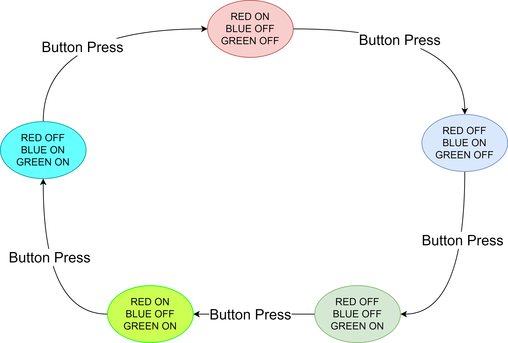

# Lab 1 exercises

1. Blinky led
Use the function available in drivers/fsl_gpio.h and the definitions available in board/board.h to create a led that blinks.
**Note**: this processor is running at 96MHz we need to have a delay for to see the blinking. Use 0xFFFFFF in an empty for loop to create a delay.
Use `GPIO_PinInit` and `GPIO_PinWrite`/`GPIO_PortToggle` for this exercise.

2. Blinky led for Red and Blue lights of the RGB LED
There is one RGB LED available on the LPC board. Adapt the code in such a way that the LED red and blue lights are out of phase (when the RED light is on, the blue one is off). What happens if we turn them both on at the same time?

3. Blinky LEDs with different blink rates
Adapt the code such that we the two leds blink with different rates.

4. Read button and implement debounce
Read the button and implement a debounce scheme, use an LED to assess if the debounce works as expected:

    * short press of button should do nothing.
    * long press should turn the led on while button is pressed.

    **Note**: A value of `0` for the pin means that led is ON.

5. Finite state machine with different blink rates based on 5 states

