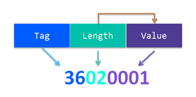

# Lab 2 exercises

1. Import the example for PWM: `ctimer_pwm_example`. Answer the following questions:

    1. How is the pin configuration set up?
    2. Modify the example to:
        1. Change the led blink frquency such that it is observable
        2. Have the led go in increments of 5% duty cycle. This transition should be observable(use a empty for loop with `0x2FFFFF` as the loop counter for the delay). Make sure the counter in the for loop does not get optimized out!

2. Create a new project using the instructions from the manual(TBD, we only need to add ctimer to drivers). Add the following 2 lines to the main loop:

    ~~~~C
    USART_ReadBlocking(USART0, &ch, 1);
    USART_WriteBlocking(USART0, &ch, 1);
    ~~~~

    Define `ch` as a character outside the main loop and add `fsl_suart.h' to the included header files.
    This code will echo any characters send via UART. Check how the example works with HERCULES.
    Modify the program such that we can:
    1. Respond with all caps
    2. Have a message to switch between to lower and to upper as response for message. The first byte of the message will make this decision: u for uppercase and l for lowercase. What happens if we send for example “uMult”
    What happens if we send multiple characters at once? The code only read 1 at a time.
3. Create a TLV scheme as below to fix the issue in the above exercise. In our main main loop receive 1 byte(the tag), use a switch statement to go to the selected function(upper or lowercase), receive the length part and then receive the number of bytes of the message(defined by length).
    The structure is as follows:
    \
    Tag -> uint8_t
    Length -> uint8_t
    Value -> no of bytes defined by Length

    

    1. Increase the maximum data we can receive to 65k
    Depending on how you approach this problem, you might need to be carefull of endianess!
    2. Add two more tags:
        1. z -> every even character is Uppercase,
        2. x-> every odd character is lowercase
    Odd or even from the point of view or position in the input(first character is even(position 0) second character is odd(position 1) etc.
    3. Add one more tag: b -> Remove all non printable characters from the input

4. Combine the pwm and the USART exercises such that you enable PWM on the BLUE led and create a command to change the duty cycle using `CTIMER_UpdatePwmDutycycle`. The command will receive any number between 1 and 99. If the command is valid the application will send 'success' on UART after doing the setting, othewise it will send 'fail' and ignore the command.
