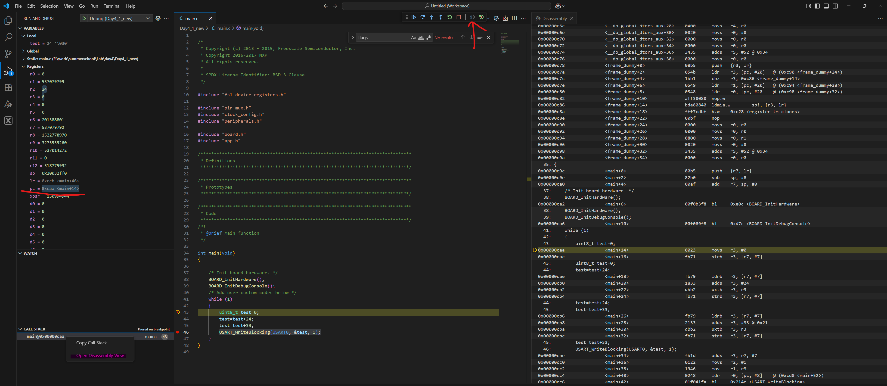

1. Manual exercise: Write a simple program that does some aditions(make sure they are not optimized). For example:
~~~~C
        uint8_t test=0;
        test=test+24;
        test=test+33;
~~~~
Send `test` over UART. Using the dissasembly view, the registers and breakpoints, modify the program counter to skip the: +33 adition. In order to do this you will need to identify the `adds` command in the dissasembly view that you will need to skip and skip it my modifying the PC register to "skip" over it. Check in Hercules in you get the modified result. This is a basic attack on an embedded target.

Note: To open the dissasembly view right click on any entry in CALL STACK. In order to step through assembly instructions you will need to activate the Instruction Stepping Mode found on the debug pannel after stop.
{ width=500px }
-=
2. Implement a non time constant memory compare. For example, as an input we receive a input via UART of 3 bytes, where each element can have values between 0 and 2. Non time constant means that we check each byte and and the first mismatch we return "FAIL" on UART, if all bytes pass we return "PASS". Add a "secret key" to compare against on the micracontroller.

    1. add a delay(1-2 seconds) such that we can distinguish when the function fails after 1 byte or 2 or 3. This is the non time constant part.
    2. Try to see if you can guess the secret password just by using Hercules and seeing how fast it fails. How many attempts do we need to crack the code.
    3. Change the implementtion to be time constant

3. Implement the Caesar cipher using a TLV encoding on UART. Have separate commands for encryption and decryption. Shift by 3 characters.

4. Use source files from aes to implement a chipher with commands for encryption and decryption. In `Project Files\armgcc\CMakeLists.txt` add `"${ProjDirPath}/../AES.c"` to `add_executable(${MCUX_SDK_PROJECT_NAME}`.
Use https://www.toolhelper.cn/en/SymmetricEncryption/AES to create a reference to compare against.

    The AES algorithm works on blocks of 16 bytes (input/output):
    Data must be sliced into 16 byte chunks.

5. Implement CBC mode of operation.

    CBC mode of operation use diffusion to break patterns in encrypted data.
    each encrypted data block is XORed with next plain data block before encryption.
    For first block an IV (initialization vector) is used.
    Encrypt the message below.

    `See you at 13 o'clock in class, do not be late!!!`

    Modify input data for decryption algorithm in such way the decrypted text still appears valid.

    !Hint if you change one byte from IV only corresponding byte from first block will be altered.

6. Implement CBC MAC

    CBC MAC is MAC algorithm based on block cipher CBC mode allways using IV set with 0.

7. Implement CTR mode of operation. (Optional can be done in day5)

    CTR mode use a counter. the algoritm encrypt the counter and the XOR te output with plain text.

    Then the counter is incremented and the process is repeated until all data are encrypted.
