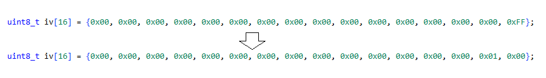
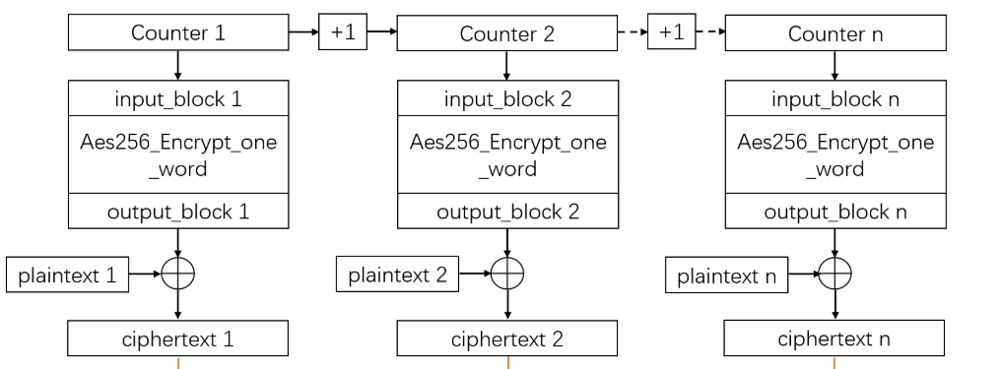

1. Implement missing AES cipher modes (from previous lab).

2. Working with big numbers.
    a. In cryptography, working with big numbers that exceeds usual data types size is common. Even simple operations have to be performed on buffers.
    Implement a function that increments a counter on 16 bytes.
{ width=800px}
    b. Create test scenarios to check the implementation. What happens at overflow?

    c. Optional: Implement big number multiplication (find a way to multiply numbers on e.g. 30 bytes each).

3. Implement CTR mode of operation.
CTR (Counter) mode uses a counter value that is encrypted with a block cipher. The
resulting ciphertext is then XORed with the plaintext to produce the final encrypted
output. The counter is incremented for each block of plaintext.
{ width=800px}

4. Using the already implemented Cipher, implement the AES CCM (simplified) operation mode presented below.

{ width=800px}
{ width=800px}

