## Tools

### LPCXpresso55S69 Development Board

The LPCXpresso55S69 and LPCXpresso55S28 boards include the following features:

- LPC55S69 Dual Cortex-M33 core processor or LPC55S28 Cortex-M33 processor
- Onboard, high-speed USB, Link2 debug probe with CMSIS-DAP and SEGGER J-Link protocol options
- UART and SPI port bridging from LPC55Sxx target to USB via the onboard debug probe
- Optional external debug probes with trace option (10 or 20 pin Cortex-M connectors)
- RGB user LED
- Reset, ISP, User/Wakeup and user buttons
- Multiple Expansion options, including Arduino UNO, Mikroe Click and PMod
- Micro SD card slot
- NXP MMA8652FCR1 accelerometer
- Stereo audio codec with line in/out
- High / full speed USB port with micro A/B connector for the host or device functionality
- Reset button

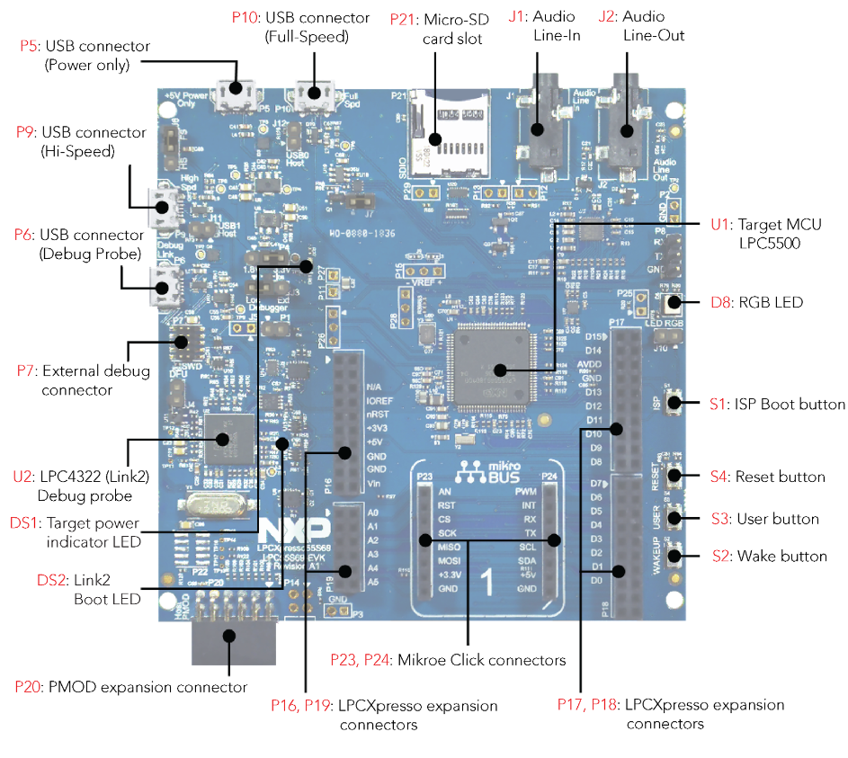{ width=700px }

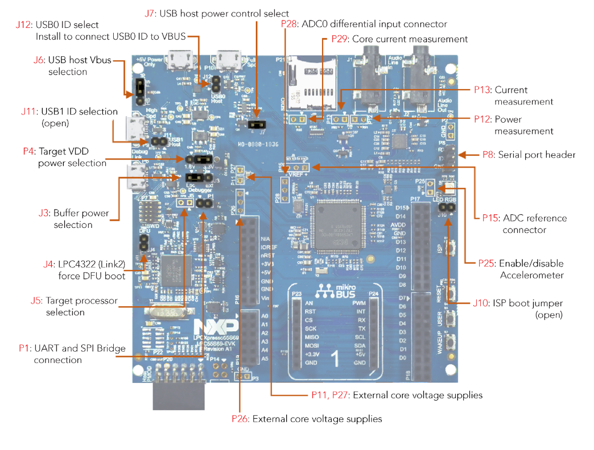{ width=700px }

Why do we need SDKs?

- An SDK (Software Development Kit) is a collection of software tools, libraries, documentation, and sample code that developers use to create applications for specific hardware or software platforms. SDKs streamline the development process by providing the necessary components and resources in one package.

  - Hardware Abstraction - it simplifies access to hardware by offering drivers and libraries.
  - Sample Code and Documentation - provides a lot of examples that showcase the functionalities on the specific board/development kit.
  - Consistency and Efficiency - provides standardized interfaces and already follows coding guidelines.
  - Support and Updates - ongoing support provided by the manufacturer/community.

An SDK can be downloaded by searching for the development board name and accessing the development board main page (provided below) or by accessing the NXP portal, `MCUXpresso SDK Builder` and searching for the board we need the toolkit for.

**Useful Links:**

- [Development Board Purchase details, documentation and SDK](https://www.nxp.com/design/design-center/software/development-software/mcuxpresso-software-and-tools-/lpcxpresso-boards/lpcxpresso55s69-development-board:LPC55S69-EVK){ width=700px }
- [MCUXpresso SDK Builder](https://mcuxpresso.nxp.com/en/welcome){ width=700px }

### MCUXpresso IDE

The MCUXpresso IDE offers advanced editing, compiling, and debugging features with the addition of MCU-specific debugging views, code trace and profiling, multicore debugging, and integrated configuration tools.

#### Getting started with the MCUXpresso IDE

1. Select Working Directory

    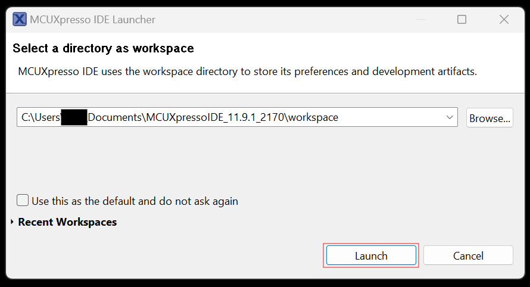{ width=500px }

2. Welcome Page

    Either use this page to create/import projects, or dismiss it and go to the main IDE view.

    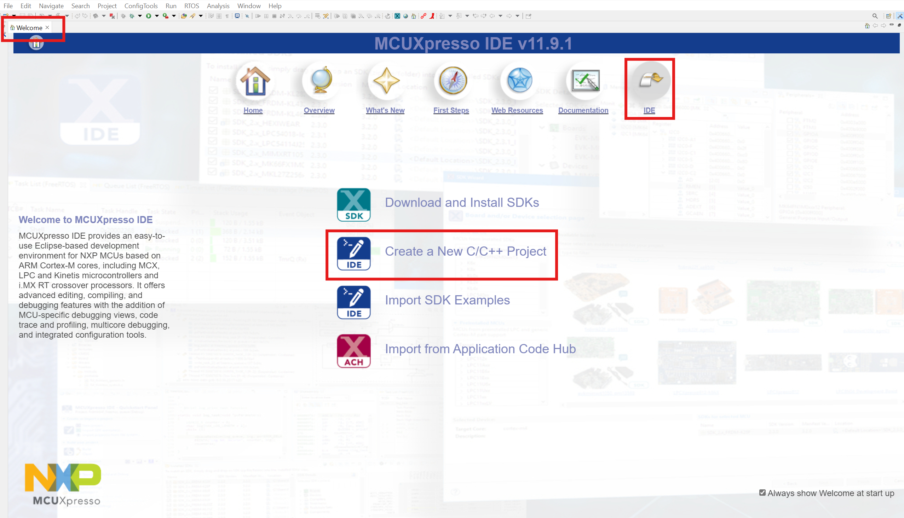{ width=600px }

3. Create New Project

    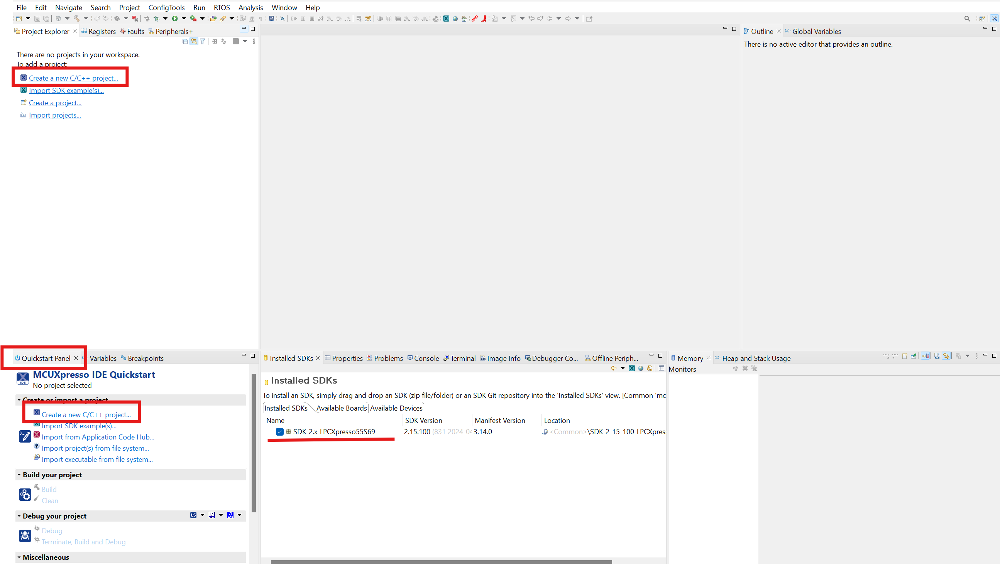{ width=600px }

4. Select Development Board

    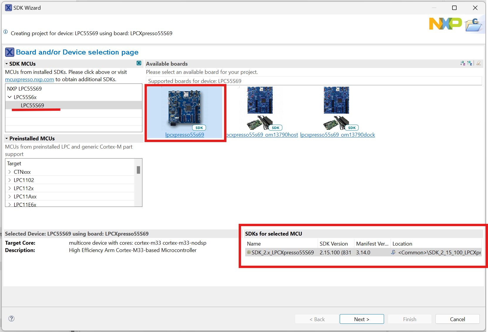{ width=600px }

5. Project Name, Desired APIs

    The next step will allow us to give our project a representative name, and include the desired software components (e.g. the driver for `ctimer`).

    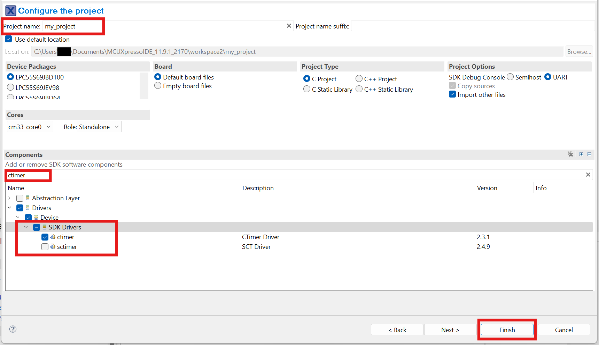{ width=600px }

The project structure is presented below.
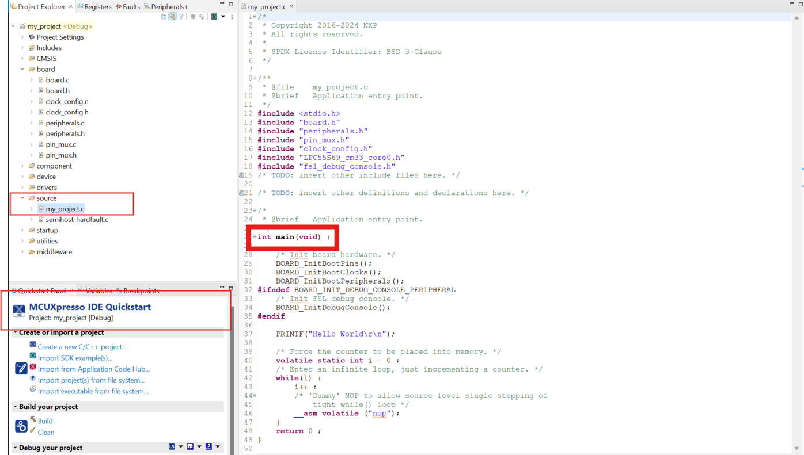{ width=700px }

The application can now be built and executed.
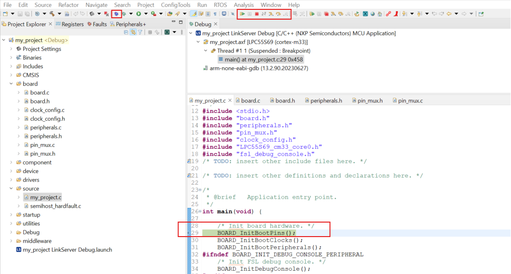{ width=700px }

**Note**: Remember to TERMINATE the program before rebuilding, or triggering another debug session.

Some useful tips:

- the `main` function (our application entry point) will be inside `source/<project_name>.c`.
- the `board` folder provides information and API interfaces for board-specific components, such as on-board LEDs, buttons, and communication interfaces. The macro definitions within these files map out the connections to these components, which can also be verified by referring to the board's schematic.
    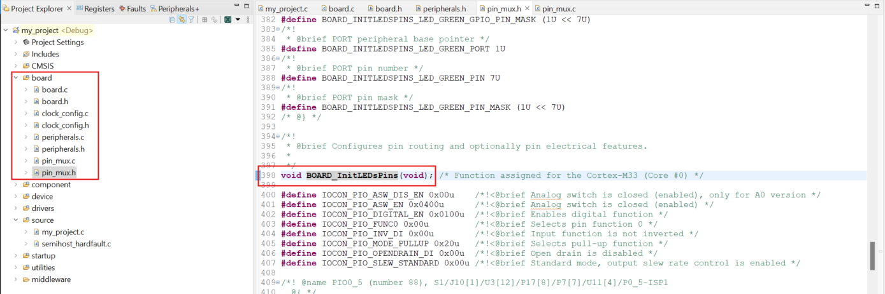{ width=600px }
- the `drivers` folder provides the drivers for all included components (on step 5), such as the USART driver.

  - header: `drivers/fsl_usart.h` - contains macro definitions and functions prototypes.
  - source: `drivers/fsl_usart.c` - contains C implementation for internal and external functionalities.
  - useful C functions:

    ~~~~C
    status_t USART_ReadBlocking(USART_Type *base, uint8_t*data, size_t length);
    status_t USART_WriteBlocking(USART_Type *base, const uint8_t*data, size_t length);
    ~~~~

**Useful Links:**

- [Download link & User Guide](https://www.nxp.com/design/design-center/software/development-software/mcuxpresso-software-and-tools-/mcuxpresso-integrated-development-environment-ide:MCUXpresso-IDE){ width=600px }

### Hercules

Hercules SETUP utility is a useful serial port terminal (RS-485 or RS-232 terminal). This terminal application will be used for serial communication through UART.

This is the output we will receive when running the default `main` function generated when creating new projects. Additionally, we can send ASCII characters. By checking the `HEX` box, we can send hexadecimal strings to the device.

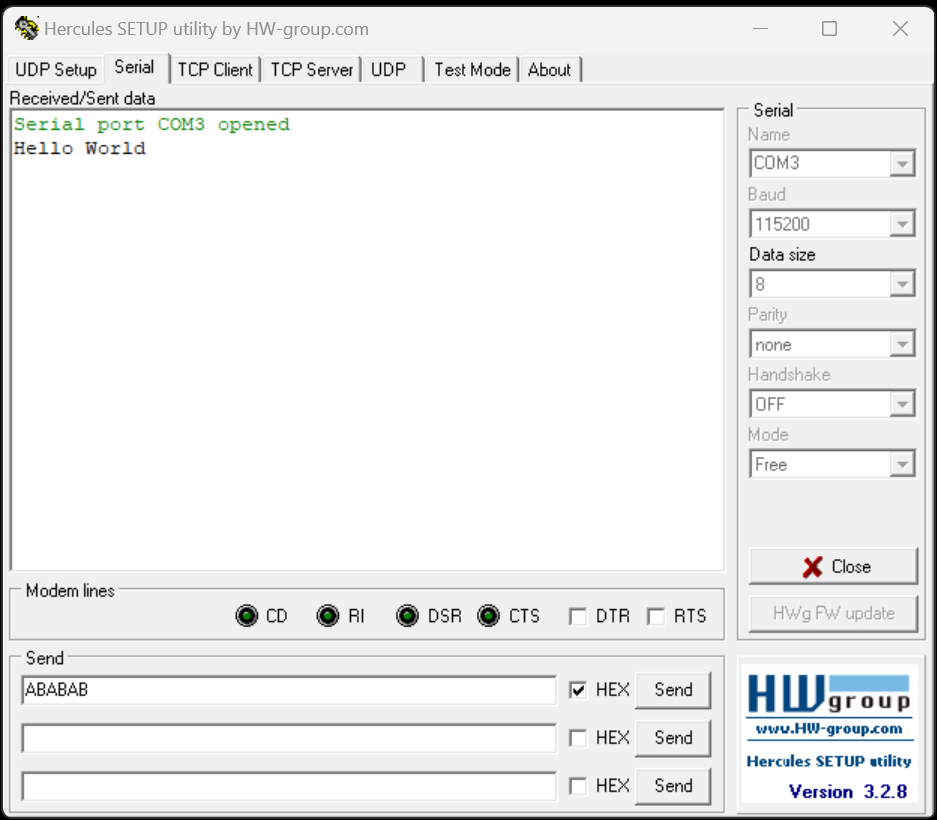{ width=700px }

To identify the `COM` port of the device, open `Device Manager`.

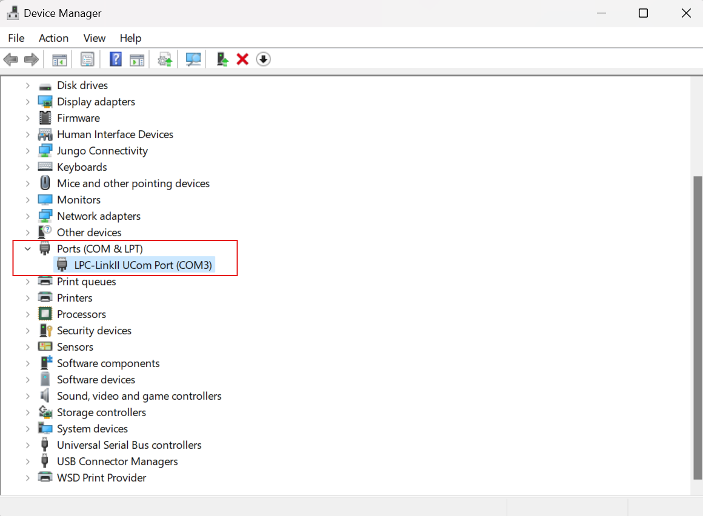{ width=700px }

**Useful Links:**

- [Download Hercules](https://www.hw-group.com/software/hercules-setup-utility){ width=700px }