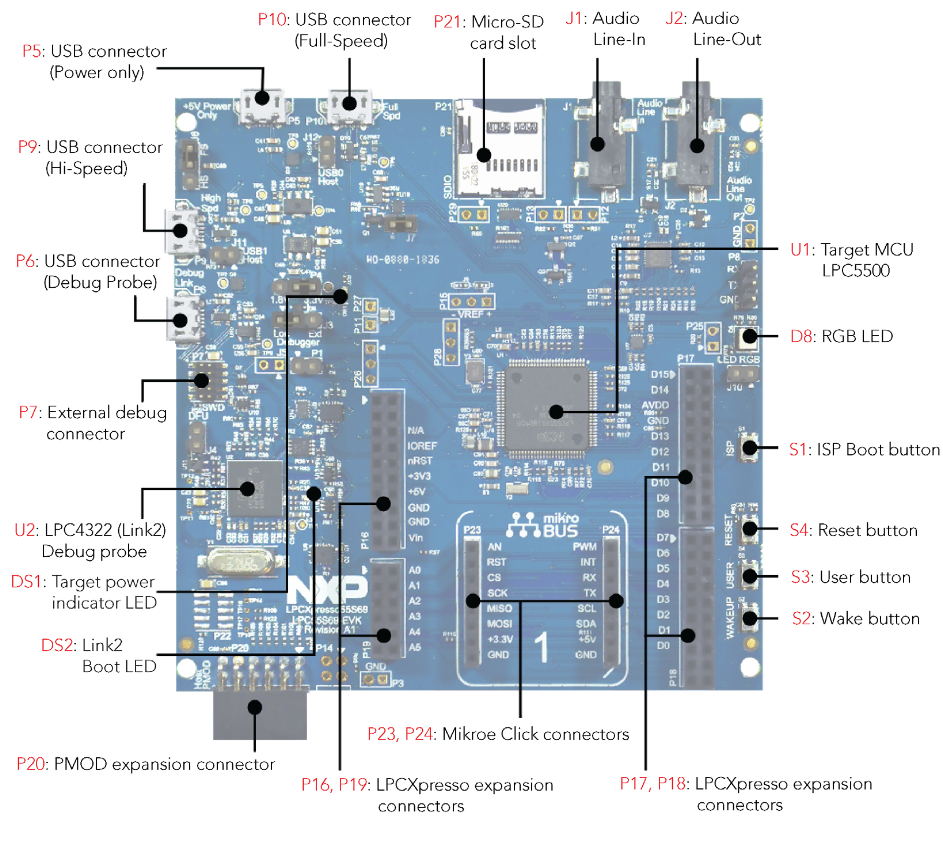
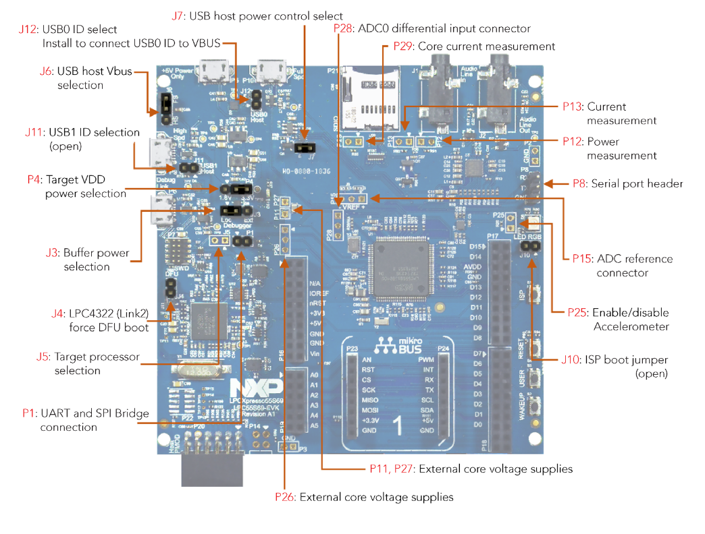
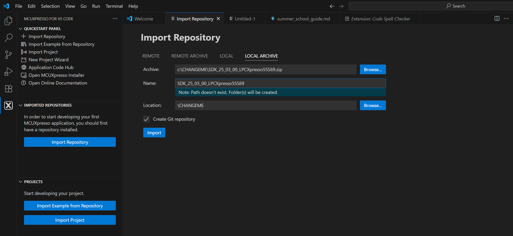
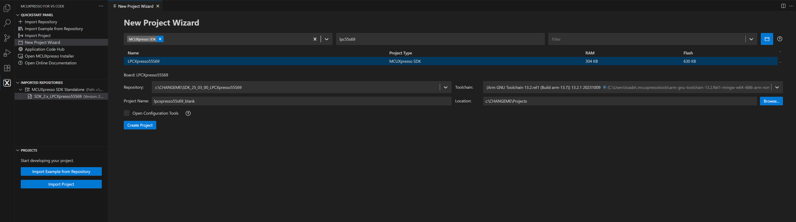
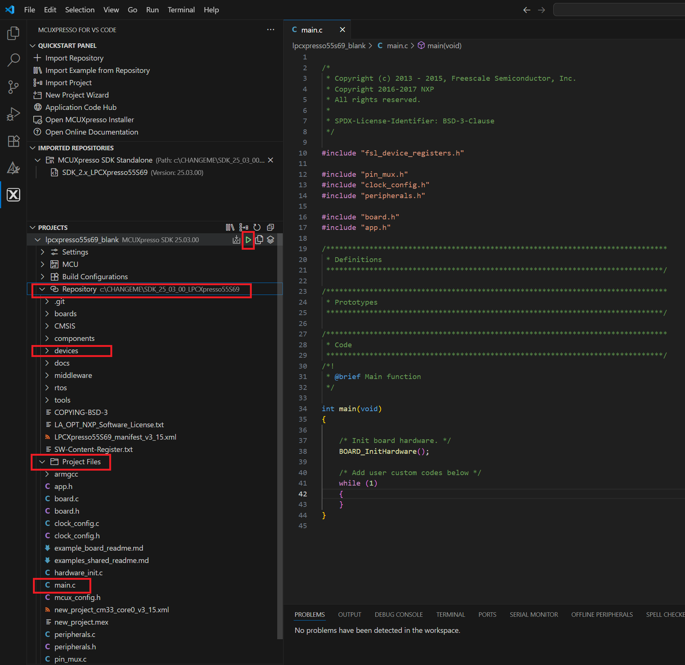
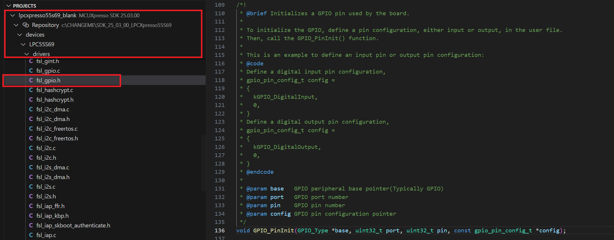
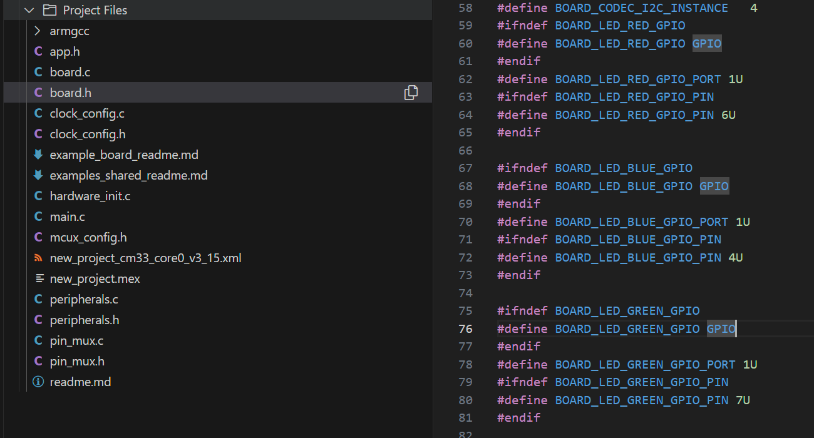
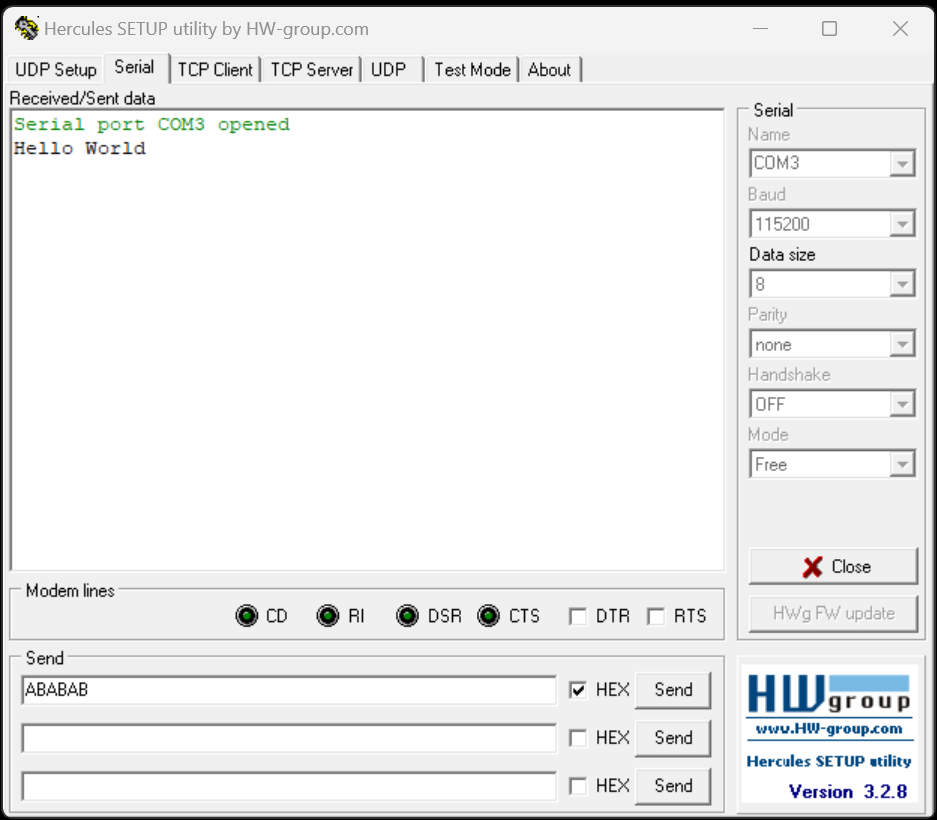
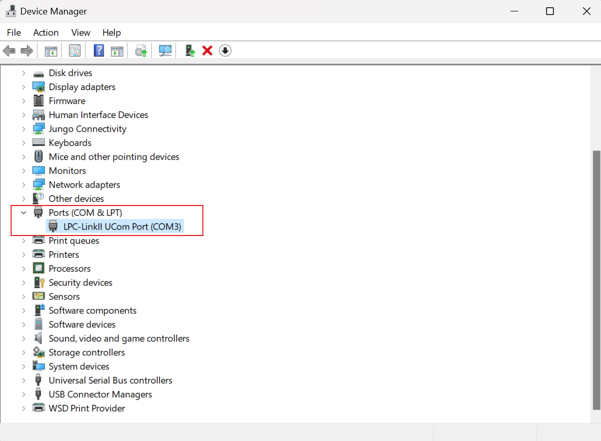

## Tools

### LPCXpresso55S69 Development Board

The LPCXpresso55S69 and LPCXpresso55S28 boards include the following features:

- LPC55S69 Dual Cortex-M33 core processor or LPC55S28 Cortex-M33 processor
- Onboard, high-speed USB, Link2 debug probe with CMSIS-DAP and SEGGER J-Link protocol options
- UART and SPI port bridging from LPC55Sxx target to USB via the onboard debug probe
- Optional external debug probes with trace option (10 or 20 pin Cortex-M connectors)
- RGB user LED
- Reset, ISP, User/Wakeup and user buttons
- Multiple Expansion options, including Arduino UNO, Mikroe Click and PMod
- Micro SD card slot
- NXP MMA8652FCR1 accelerometer
- Stereo audio codec with line in/out
- High / full speed USB port with micro A/B connector for the host or device functionality
- Reset button

{ width=700px }

{ width=700px }

Why do we need SDKs?

- An SDK (Software Development Kit) is a collection of software tools, libraries, documentation, and sample code that developers use to create applications for specific hardware or software platforms. SDKs streamline the development process by providing the necessary components and resources in one package.

  - Hardware Abstraction - it simplifies access to hardware by offering drivers and libraries.
  - Sample Code and Documentation - provides a lot of examples that showcase the functionalities on the specific board/development kit.
  - Consistency and Efficiency - provides standardized interfaces and already follows coding guidelines.
  - Support and Updates - ongoing support provided by the manufacturer/community.

An SDK can be downloaded by searching for the development board name and accessing the development board main page (provided below) or by accessing the NXP portal, `MCUXpresso SDK Builder` and searching for the board we need the toolkit for.

**Useful Links:**

- [Development Board Purchase details, and documentation](https://www.nxp.com/design/design-center/software/development-software/mcuxpresso-software-and-tools-/lpcxpresso-boards/lpcxpresso55s69-development-board:LPC55S69-EVK){ width=700px }
- [IDE: Extensions for VS Code](https://www.nxp.com/design/design-center/software/development-software/mcuxpresso-software-and-tools-/mcuxpresso-for-visual-studio-code:MCUXPRESSO-VSC)
- [MCUXpresso SDK Builder](https://mcuxpresso.nxp.com/en/welcome){ width=700px }

### MCUXpresso For VS Code

 MCUXpresso for Visual Studio Code (VS Code) provides an optimized embedded developer experience for code editing and development. MCUXpresso for VS Code supports NXP MCUs based on Arm® Cortex®-M cores including MCX, LPC, Kinetis and i.MX RT. MCUXpresso for VS Code allows developers the flexibility to work on projects from Zephyr, or MCUXpresso SDK in conjunction with Open-CMSIS-Packs.

The VS Code extension organizes relevant information including installed SDK repositories, available debug probes, user projects and links to help get started. A popular QuickStart panel provides access to the most popular actions. Intellisense improves upon standard auto-complete and auto-format features. The debug view provides access to breakpoints, variable/register views, call stack and thread awareness while using normal debug controls to step through the code.

#### Getting started with the MCUXpresso IDE

1. Select the **MCUXpresso for VS Code** in the sidebar and click on **Import Repository**. Please use the folder specified by the Lab assistants on this step, the CHANGEME folder is a placeholder.

    { width=500px }

2. Click on **New Project Wizard**

    Select in the first dropdown **MCUXpresso SDK**.
    Select in the second dropdown our board: lpc55s69.
    Select in the repository the only entry available(the one we just installed).
    Select in the toolchain the only entry available.
    Select in the ProjectName: *yourname*_day*x*_ex*y*, for example: toader_day1_ex1
    Select in location: the temporary location you will use for these project, will be communicated by the lab assistants.

    { width=600px }

    Hit create project

The project structure is presented below. Thye project can be downloaded(to the board) and debugged with the green play byutton highlighted in the red square.
The main two parts of interest for files are **Project Files** and **Repository**.
{ width=700px }

In **Project Files** will will find all the filkes corresponding to your project. All the changes we will make in our exercises will be here.
In the 
In the **Repository** we will find all the drivers that we will need throughout the days. To be more precise in `Repository/devices/LPC55S69/drivers/fsl_gpio.h` we will find the gpio driver header with doxygen documentation for each function.
We will not change any code in **Repository** this is just a collection of drivers we need!
{ width=700px }

Some useful tips:

- the `main` function (our application entry point) will be inside **Project Files**.
- the `board` header file provides information and API interfaces for board-specific components, such as on-board LEDs, buttons, and communication interfaces. The macro definitions within these files map out the connections to these components, which can also be verified by referring to the board's schematic.
    { width=600px }
- the `drivers` folder provides the drivers for all included components, such as the USART driver.

  - header: `Repository/devices/LPC55S69/drivers/fsl_usart.h` - contains macro definitions and functions prototypes.
  - source: `Repository/devices/LPC55S69/drivers/fsl_usart.c` - contains C implementation for internal and external functionalities.
  - useful C functions:

~~~~C
status_t USART_ReadBlocking(USART_Type *base, uint8_t*data, size_t length);
status_t USART_WriteBlocking(USART_Type *base, const uint8_t*data, size_t length);
~~~~

**Useful Links:**

- [Getting Started Guide](https://www.nxp.com/design/design-center/training/TIP-GETTING-STARTED-WITH-MCUXPRESSO-FOR-VS-CODE){ width=600px }

### Hercules

Hercules SETUP utility is a useful serial port terminal (RS-485 or RS-232 terminal). This terminal application will be used for serial communication through UART.

This is the output we will receive when running the default `main` function generated when creating new projects. Additionally, we can send ASCII characters. By checking the `HEX` box, we can send hexadecimal strings to the device.

{ width=700px }

To identify the `COM` port of the device, open `Device Manager`.

{ width=700px }

**Useful Links:**

- [Download Hercules](https://www.hw-group.com/software/hercules-setup-utility){ width=700px }